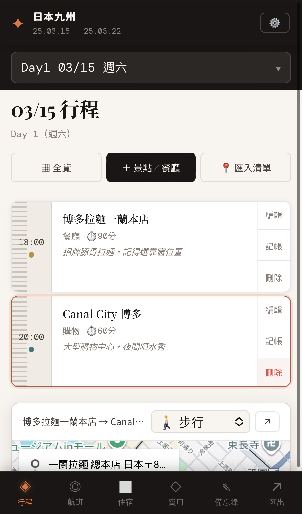

# lets-fun-travel
A travel planner website connect with your Google Sheet, where you can record your schedule, accounts, flights, hotel. 

## How it works
- Connect with Google Sheet as backend dataset: The frontend web will read and write data to the Google Sheet through the Apps Script, including itinerary, flight, hotel, expense, memo, and log.
- There has a iframe google map can show the itinerary on the map. You can search the location on the map and add it to the itinerary.

## How to deploy
1. Create a Google Sheet: set up the invite code in "基本資訊" B3
2. Go to **"Application" -> "Apps Script"**, create a Apps Script
3. Copy the app script code from `app.js`, which has shown on the login web page, to the Apps Script
4. Deploy the Apps Script as a web app: excuter is your google account, access level is **"Anyone"**
5. Copy the **web app url** to the login web page "Apps Script Web App URL"
6. Copy the **google sheet share link** to the login web page "Google Sheet Link":
    - **Share with limit mails**: the web still can work and update all changes to the Google Sheet when the user open the web on the browser that has login with the same google account; Otherwise, the web will not update any changes to the Google Sheet.
    - **Share with anyone**: anyone with the web share link and invite code can access the web, and all changes will update to the google sheet successfully.
7. Copy the invite code, where you set up in "基本資訊" B3 in your Google Sheet, to the login web page "Invite Code"
8. Click the setup button: The Google Sheet will create 7 tabs: "基本資訊", "行程", "航班", "住宿", "費用", "備忘錄", "操作紀錄"

## How to use
1. Open the web page and enter the google sheet link and invite code, then click the setup button -> The web page will auto-detect the google sheet link and invite code from the url, and fill them in the input fields.
2. Add itinerary: 
    - There are 2 ways:
        - Add the itinerary name: the web will auto-detect the location from the name and add it to the map.
        - Add the complete Google Map url of the itinerary: the web will auto-detect the location from the url and add it to the map.
    - When you click one of the schedule, the map will auto-focus on the location and show the transportation time from the previous location.
3. Record expense: You can add the expense on the web page, also, can record the split expense between travel partners.
4. Add flight, hotel, memo: You can add the flight, hotel, memo on the web page, and the data will be updated to the google sheet.
5. Share to your travel partner: Copy the web share link and send invite code to your travel partner, and they can access the web and update the data to the Google Sheet.
6. Export the schedule to PDF: You can export the whole travel schedule to PDF.